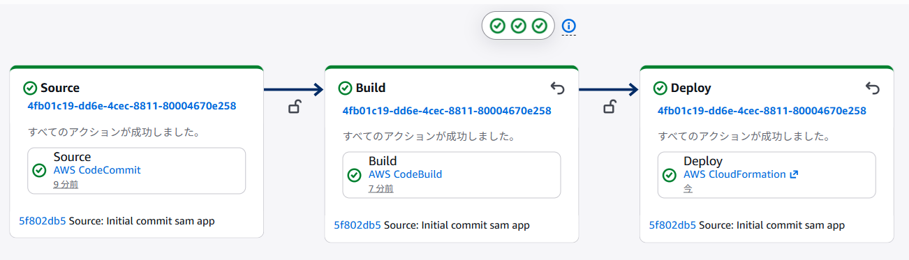

# AWS SAM + CodePipeline ハンズオン

* CodeCommit リポジトリに AWS SAM のリソースを格納し、AWS CodePipeline でパイプラインによるサーバーレスアプリケーションのデプロイ環境を作成します。

* マネジメントコンソールと CloudShell を使用して操作します。

## 事前準備: 必要な IAM ロールの作成

* **チーム内で自分のユニークな ID を決めてください。**

1. マネジメントコンソールで CloudFormation のページを開きます。

1. 左側のナビゲーションメニューで [**スタック**] をクリックします。

1. [**スタックの作成**] - [**新しいリソースを使用（標準）**]をクリックします。

1. [**テンプレートの指定**]  で [**テンプレートソース**] に [**Amazon S3 URL**]  を選択します。

1. [**Amazon S3 URL**]  に下記を入力します。
    - ```
      https://tnobep-work-public.s3.ap-northeast-1.amazonaws.com/sam-pipeline-work/pipeline-roles.yaml
      ```

1. [**次へ**]  をクリックします。

1. [**スタック名**]  に `sam-pipeline-work-role-stack-(自分のID)` と入力します。

1. [**パラメータ**] で ProjectName に `sam-app-(自分のID)` と入力します。

1. [**次へ**]  をクリックします。

1. [**機能**]  で　下記の記載があるチェックボックスにチェックをします。
    - AWS CloudFormation によって IAM リソースがカスタム名で作成される場合があることを承認します。

1. [**次へ**]  をクリックします。

1. [**送信**]  をクリックします。

1. スタックの作成完了を確認してから次の手順に進みます。

### 1. CodeCommit リポジトリの作成

マネージメントコンソールの左下の CloudShell のアイコンをクリックして、以下のコマンドを CloudShell から実行します。

```bash
MYID=(自分のID)
```

```bash
aws codecommit create-repository --repository-name sam-pipeline-work-${MYID} --repository-description "SAM Pipeline Hands-on"
```

* プロンプトが返ってこない場合は q キーを押下して下さい。

* 以下のコマンドを実行して、デフォルトブランチ名を `main` に設定します。

```bash
git config --global init.defaultBranch main
```

```bash
cd ~
```

* クローンを実行してローカルのリポジトリを作成します。

```bash
git clone https://git-codecommit.ap-northeast-1.amazonaws.com/v1/repos/sam-pipeline-work-${MYID} 
```

* クローンが成功すると、`sam-pipeline-work-${MYID}` ディレクトリが作成されます（空のリポジトリの警告が出ますが問題ありません）。

### 2. GitHub から取得したコードを CodeCommit へ Push


```bash
cd ~
```

```bash
git clone https://github.com/tetsuo-nobe/sam-pipeline-work.git sam-pipeline-work-github
```

```bash
cd ~/sam-pipeline-work-github
```

```bash
cp -rp $(ls -A | grep -v "^.git$") ~/sam-pipeline-work-${MYID}/
```


* ファイルがコピーされたことを確認します。

```bash
ls ~/sam-pipeline-work-${MYID}
```

### 3. CodeCommit のローカルリポジトリをコミットする

1. CloudShell で以下のコマンドを実行し、ファイルをステージングしてコミットします。

```bash
cd ~/sam-pipeline-work-${MYID}
```

```bash
git add .
git commit -m "Initial commit sam app"
```

### 4. CodeCommit のローカルリポジトリをプッシュする

1. CloudShell で以下のコマンドを実行し、CodeCommit のリモートリポジトリにプッシュします。

```bash
git push -u origin main
```

2. プッシュが成功したら、CodeCommit コンソールでリポジトリの内容を確認してみましょう。
   - CodeCommit コンソールで `sam-pipeline-work-${MYID}` リポジトリを開き、ファイルが表示されることを確認します。
   - 確認したら、CloudShell を閉じます。
---

## 5. AWS CodeBuild のビルドプロジェクトを作成

1. マネージメントコンソールで CodeBuild のページを開きます。

1. 左側のナビゲーションメニューから [**ビルドプロジェクト**] をクリックします。

1. [**プロジェクトを作成する**] をクリックします。

1. [**プロジェクト名**] に `sam-build-project-(自分のID)` を入力します。

1. [**ソースプロバイダ**] に [**AWS CodeCommit**] を選択します。

1. [**リポジトリ**] に [**sam-pipeline-work-(自分のID)**] を選択します。 

1. [**ブランチ**] に [**main**] を選択します。

1. ページを下にスクロールして、[**サービスロールのアクセス許可**] で [**既存のサービスロール**] を選択します。

1. [**ロールの ARN**] で `sam-app-(自分のID)-codebuild-role` を選択します。

1. [**Buildspec**] で [**buildspec ファイルを使用する**] を選択します。

1. ページ下部に [**ビルドプロジェクトを作成する**] をクリックします。

1. 作成したビルドプロジェクトのページで [**ビルドを開始**] をクリックします。

1. ビルド完了までしばらく待機して、[**ステータス**] が [**成功**] になることを確認します。


---
## 6. AWS CodePipeline のパイプラインを作成

1. 左側のナビゲーションメニューから [**パイプライン・CodePipeline**] を展開表示し、[**パイプライン**] をクリックします。

1. [**パイプラインを作成する**] をクリックします。

1. [**Category**] で [**カスタムパイプラインを構築する**] を選択して [**次に**] へをクリックします。

1. [**パイプライン名**] に `sam-pipeline-(自分のID)`  を入力します。

1. [**サービスロール**] で [**既存のサービスロール**] を選択します。

1. [**ロールの ARN**] で **sam-app-(自分のID)-codepipeline-role** を選択します。

1. ページ右下にある [**次に**] をクリックします。

1. [**ソースプロバイダー**] で [**AWS CodeCommit**] を選択します。

1. [**リポジトリ名**] で `sam-pipeline-work-(自分のID)` を選択します。

1. [**ブランチ名**] で `main` を選択します。

1. ページ右下にある [**次に**] をクリックします。

1. [**プロバイダーを構築する**] で [**その他のビルドプロバイダー**] を選択します。
   
1. ドロップダウンリストから [**AWS CodeBuild**] を選択します。

1. [**プロジェクト名**] で `sam-build-project-(自分のID)` を選択します。

1. ページ右下にある [**次に**] をクリックします。

1. [**テストステージを追加**] で [**テストステージをスキップ**] を選択します。

1. [**デプロイプロバイダー**] で [**AWS CloudFormation**] を選択します。

1. [**アクションモード**] で [**スタックを作成または更新する**] を選択します。

1.  [**スタック名**] に `sam-stack-(自分のID)` を入力します。

1. [**テンプレート**] の [**アーティファクト名**] に [**BuildArtifact**] を選択します。

1. [**テンプレート**] の [**ファイル名名**] に `packaged.yaml` を入力します。

1. [**機能**] で [**CAPABILITY_IAM**] と [**CAPABILITY_AUTO_EXPAND**] を選択します。
    - 必ず 2つ選択して下さい。

1. [**ロール名**] で [**sam-app-(自分のID)-cloudformation-role**] を選択します。


1. ページ右下にある [**次に**] をクリックします。

1. ページ右下にある [**パイプラインを作成する**] をクリックします。


### パイプラインの実行完了を待つ

* Source, Build, Deploy のすべてのステージに緑色のチェックマークが表示されるまで待機します。（約 8～10 分ほど）



### デプロイされたアプリケーションを確認する

1. Deploy ステージの中に表示されている [**AWS CloudFormation**] のリンクをクリックします。

1. CloudFormation のページが表示されるので、[**出力タブ**] をクリックします。

1. [**キー**] が **HelloWorldApi** の [**値**] として表示されている URL をクリックします。 

1. ブラウザに文字列 **{"message": "hello world"}** が表示されることを確認します。

---
## 7. ブランチのコードを更新してパイプラインを再実行する

1. CodePiplien のページに戻ります。

1. 左側のナビゲーションメニューから [**ソース・CodeCommit**] を展開表示し、 [**リポジトリ**] をクリックします。

1. リポジトリの一覧から **sam-pipeline-work-(自分のID)** の名前のリンクをクリックします。

1. **hello_world** のフォルダ名のリンクをクリックし、さらに app.py ファイルのリンクをクリックします。

1. [**編集**] をクリックします。

1. 39行目の `"message": "hello world",` の部分で、`hello world` を他のメッセージに変更します。 

1. ページ下部の [**作成者名**] に 現在使用している IAM ユーザー名、[**E メールアドレス**] に `dummy-(自分のID)@example.com` と入力します。[**メッセージのコミット**] に `change message` と入力します。
1. ページ右下の [**変更のコミット**] をクリックします。

1. 左側のナビゲーションメニューから [**パイプライン・CodePipeline**] を展開表示し、[**パイプライン**] をクリックします。

1. 自分が作成したパイプライン名のリンクをクリックして、パイプラインが再実行されることを確認します。

1. パイプライン実行の完了後、アプリケーションに再度アクセスして変更が反映されていることを確認します。

*  **以上でワークは終了です。**

---

## 8. クリーンアップ

ハンズオンで作成したリソースを削除します。以下の順序で削除してください。

> **注意**: 削除する順序が重要です。依存関係があるため、下記の順番で実行してください。

### 8-1. SAM アプリケーションスタックの削除

1. マネジメントコンソールで CloudFormation のページを開きます。

1. [**スタック**] から `sam-stack-(自分のID)` を選択します。

1. [**削除**] をクリックし、確認画面で [**削除**] をクリックします。

1. スタックの削除完了を待ちます。

### 8-2. パイプラインの削除

1. CodePipeline のページを開きます。

1. `sam-pipeline-(自分のID)` のラジオボタンを選択し、[**パイプラインを削除する**] をクリックします。
    - その後表示されるダイアログで、`delete` を入力して削除します。

### 8-3. CodeBuild ビルドプロジェクトの削除

1. CodeBuild のページを開きます。

1. `sam-build-project-(自分のID)` のラジオボタンを選択し、[**アクション**] - [**削除**] をクリックします。
    - その後表示されるダイアログで、`delete` を入力して削除します。

### 8-4. CodeCommit リポジトリの削除

1. CodeCommit のページを開きます。

1. `sam-pipeline-work-(自分のID)` のラジオボタンを選択し、[**リポジトリの削除**] をクリックします。
    - その後表示されるダイアログで、`delete` を入力して削除します。

### 8-5. IAM ロールスタックの削除

1. CloudFormation のページを開きます。

1. [**スタック**] から `sam-pipeline-work-role-stack-(自分のID)` のラジオボタンをを選択します。

1. [**スタックを削除**] をクリックし、確認画面で必要な入力を行い [**スタックを削除**] をクリックします。

### 8-6. CloudWatch Logs ロググループの削除

1. CloudWatch のページを開きます。

1. 左側のナビゲーションメニューから [**ログ**] - [**ログ管理**] をクリックします。

1. `/aws/codebuild/sam-build-project-(自分のID)` を選択し、[**アクション**] - [**ロググループの削除**] をクリックして削除します。

1. `/aws/lambda/hello-function` があれば同様に削除します。

### 8-7. パイプラインのアーティファクト用 S3 バケットの削除（オプション）

1. S3 のページを開きます。

1. `codepipeline-ap-northeast-1-` で始まるバケットを探します。

1. バケットを選択し、[**空にする**] をクリックしてバケット内のオブジェクトを削除します。

1. その後、バケットを選択して [**削除**] をクリックします。

### 8-8. SAM 管理スタックとバケットの削除（オプション）

1. CloudFormation のページで `aws-sam-cli-managed-default` スタックを選択し、[**削除**] をクリックします。

1. S3 のページで `aws-sam-cli-managed-default-samclisourcebucket-` で始まるバケットを [**空にする**] してから [**削除**] します。

---

### ワークを終了する時は、マネジメントコンソールからサインアウトして下さい。

### お疲れ様でした！
